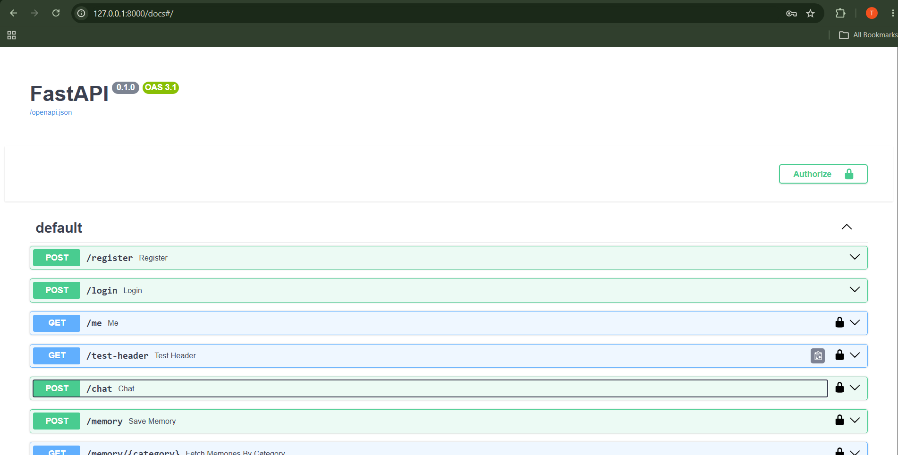
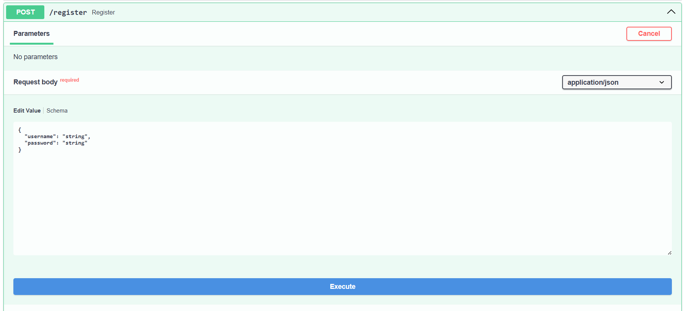
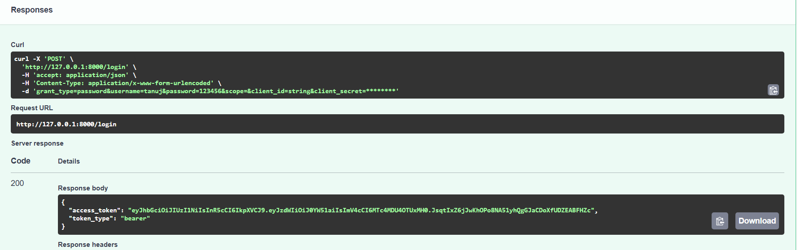
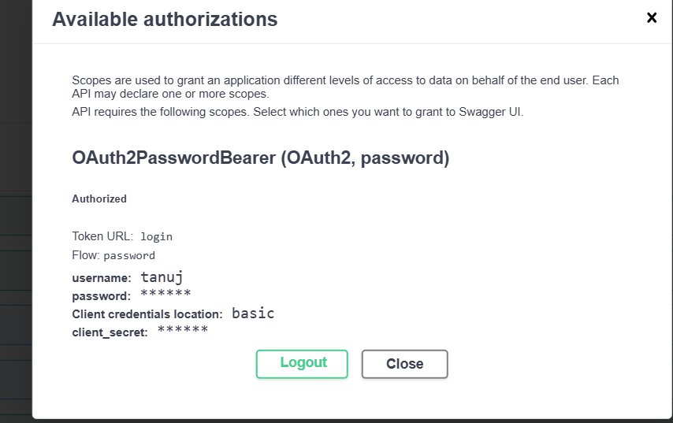
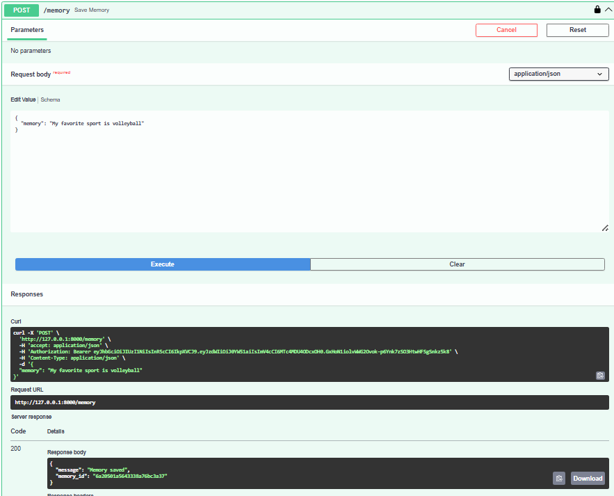
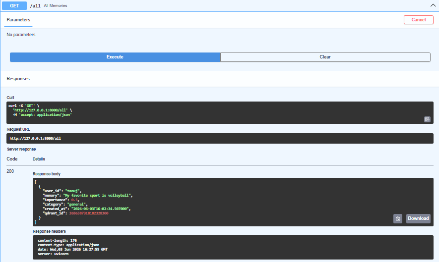
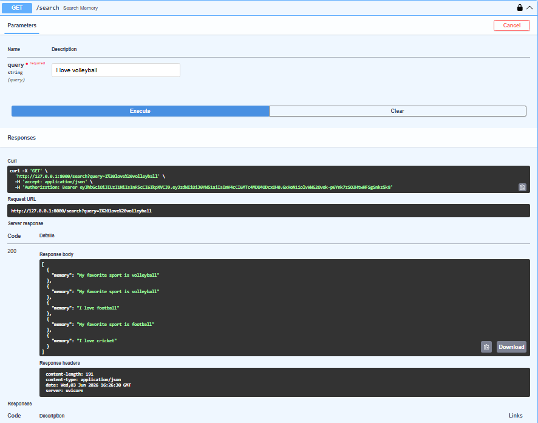
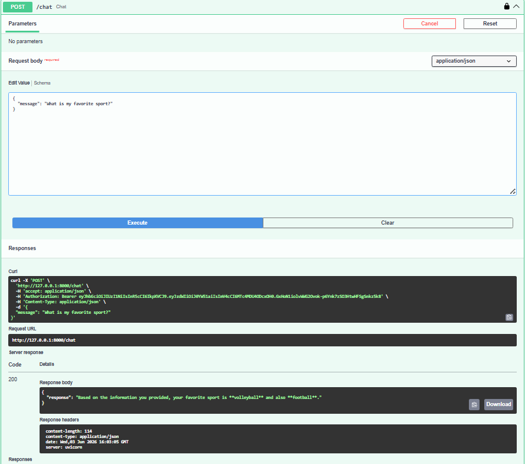
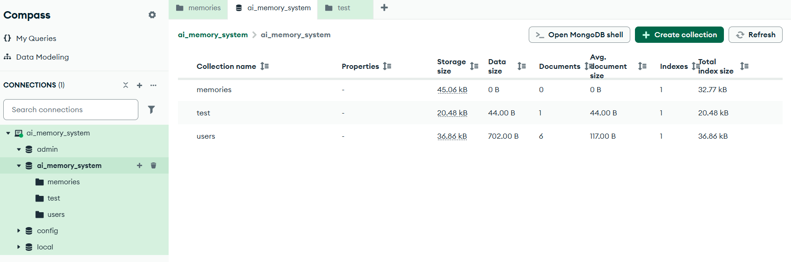
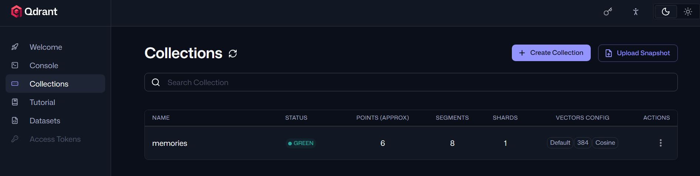

# 🧠 AI Memory System

An AI-powered memory assistant that remembers user information, performs semantic search using vector embeddings, and generates personalized responses using Gemini AI.

---

# 🚀 Features

### Authentication

* User Registration
* User Login
* JWT Authentication
* Protected Routes
* Swagger OAuth2 Authorization

### Memory Management

* Save Memory
* Retrieve Memory
* Delete Memory
* Forget Memory Feature

### AI Features

* Automatic Memory Extraction
* Memory Categorization
* Importance Scoring
* Semantic Search
* Personalized AI Responses

### Database Features

* MongoDB Storage
* Qdrant Vector Database
* Embedding-Based Retrieval

---

# 🛠️ Tech Stack

| Category        | Technology            |
| --------------- | --------------------- |
| Backend         | FastAPI               |
| Database        | MongoDB               |
| Vector Database | Qdrant                |
| Authentication  | JWT + Bcrypt          |
| Embeddings      | Sentence Transformers |
| LLM             | Google Gemini         |
| API Testing     | Swagger UI            |

---

# 🏗️ System Architecture

```text
User
 ↓
FastAPI Backend
 ↓
JWT Authentication
 ↓
Memory Extraction
 ↓
Embedding Generation
 ↓
MongoDB Storage
 ↓
Qdrant Vector Storage
 ↓
Semantic Search
 ↓
Prompt Builder
 ↓
Gemini AI
 ↓
Personalized Response
```

---

# 📂 Project Structure

```text
AI-Memory-System/
│
├── app/
│   ├── routes/
│   ├── services/
│   ├── models/
│   ├── database/
│   └── main.py
│
├── Screenshots/
│
├── requirements.txt
├── README.md
└── .env
```

---

# 📸 Project Screenshots

## Swagger API Documentation



---

## User Registration

Register a new user.



---

## User Login

Generate JWT token after successful login.



---

## Swagger Authorization

Authenticate protected routes using JWT.



---

## Save Memory

Store user memories in MongoDB and Qdrant.



---

## Memory Retrieval

Retrieve stored memories.



---

## Semantic Search

Search memories using vector similarity.



---

## Personalized AI Response

AI responds using stored user memories.



---

## MongoDB Storage

Stored memories in MongoDB.



---

## Qdrant Vector Database

Stored embeddings in Qdrant.



---

# 🔌 API Endpoints

## Authentication

| Method | Endpoint  | Description      |
| ------ | --------- | ---------------- |
| POST   | /register | Register User    |
| POST   | /login    | Login User       |
| GET    | /me       | Get Current User |

---

## Memory

| Method | Endpoint            | Description     |
| ------ | ------------------- | --------------- |
| POST   | /memory             | Save Memory     |
| GET    | /memory/{category}  | Get Memories    |
| DELETE | /memory/{memory_id} | Delete Memory   |
| GET    | /search             | Semantic Search |

---

## Chat

| Method | Endpoint | Description          |
| ------ | -------- | -------------------- |
| POST   | /chat    | Personalized AI Chat |

---

# 💡 Example Workflow

### Save Memory

```json
{
  "memory": "My favorite sport is volleyball"
}
```

### Ask Question

```json
{
  "message": "What is my favorite sport?"
}
```

### Response

```json
{
  "response": "Your favorite sport is volleyball."
}
```

---

# 🧠 AI Memory Workflow

### Memory Creation

1. User sends memory
2. Memory extracted
3. Embedding generated
4. Stored in MongoDB
5. Stored in Qdrant

### Memory Retrieval

1. User asks question
2. Query embedding generated
3. Qdrant performs semantic search
4. Relevant memories retrieved
5. Gemini generates personalized response

### Forget Memory

1. User asks to forget memory
2. Memory located
3. Memory deleted
4. Future responses updated

---

# 🔮 Future Improvements

* Memory Update Feature
* Long-Term Memory Ranking
* User Profiles
* Multi-Agent Support
* RAG Integration
* Frontend Dashboard
* Memory Analytics

---

# 👨‍💻 Author

**Tanuj Singh Rawat**

MCA (AI & ML)

FastAPI • MongoDB • Qdrant • Gemini AI • Machine Learning
